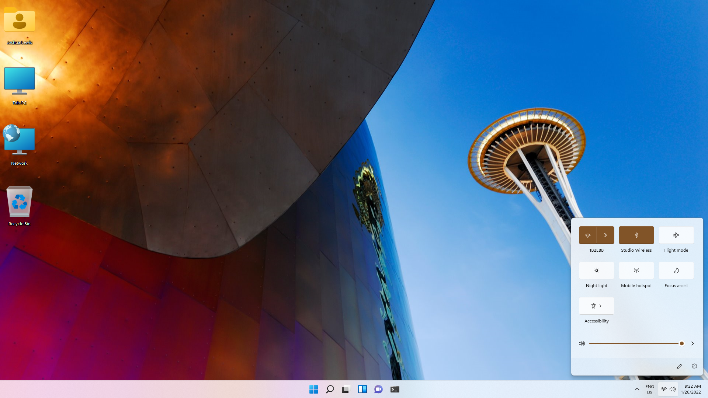
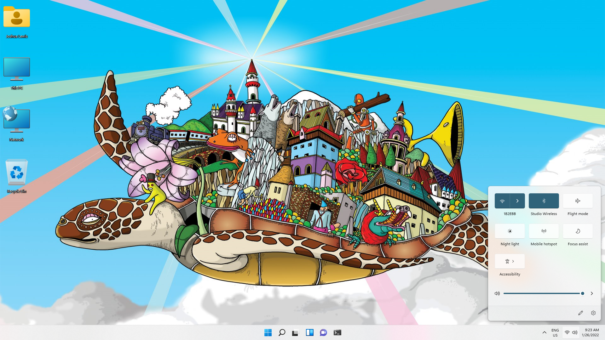
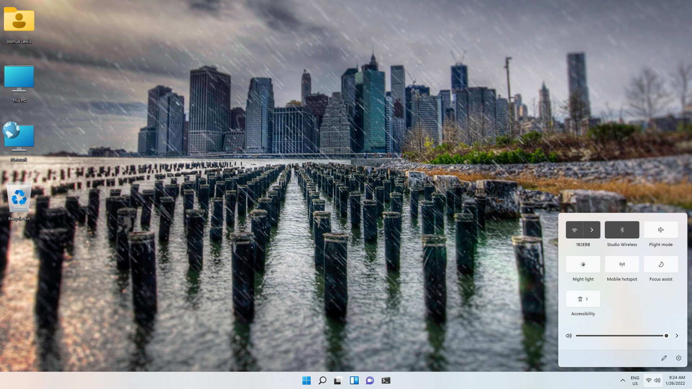
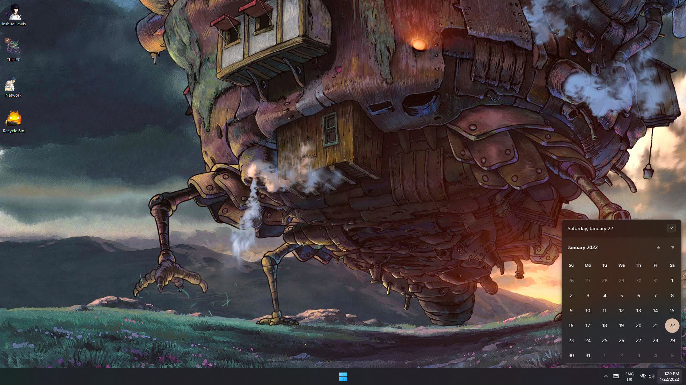
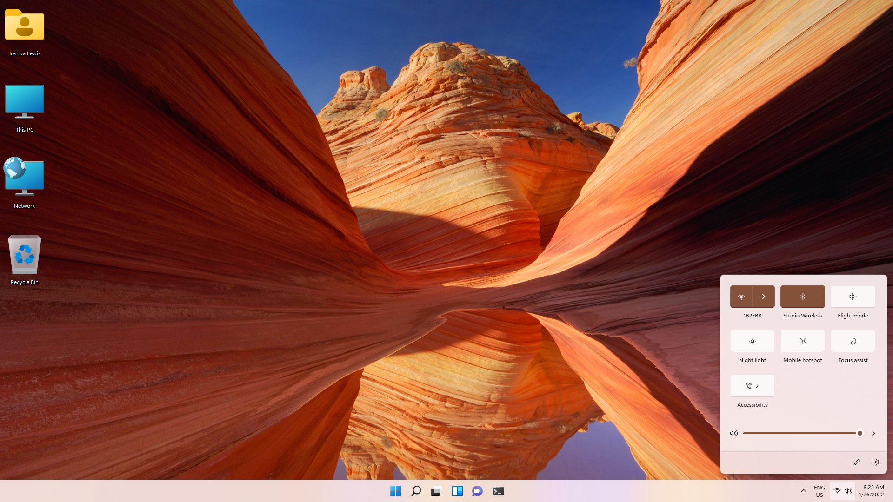
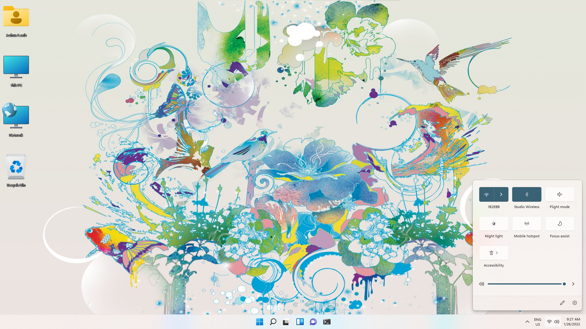
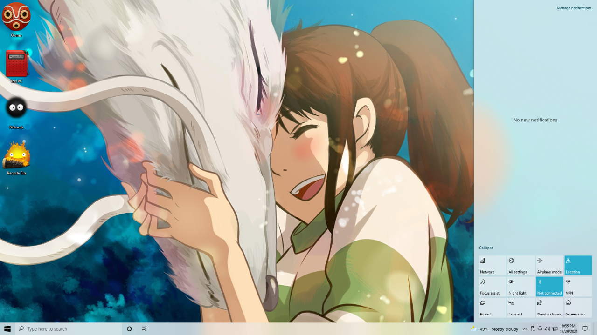

# Deskthemepacks
A collection of themes made by NimbiDev

---

## Supported OS

 - Windows 10
 - Windows 11

---

### Deskthemepacks

**Architecture** 

**Characters** 

**Cityscapes** 

**Courage TCD** 

**Howl's Moving Castle** 

**Landscapes** 

**Nature** 

**Scenes** 

**Studio Ghibli** 

**United States** 

---

### Instructions

 - To download these deskthemepacks simply click [here](https://github.com/NimbiDev/Deskthemepacks/archive/refs/heads/main.zip).
 - Note: Some of these deskthemepacks include custom dll files for the icons, as such you will need to follow the instructions provided in the theme's 'Extras' folder to ensure the icons display correctly.