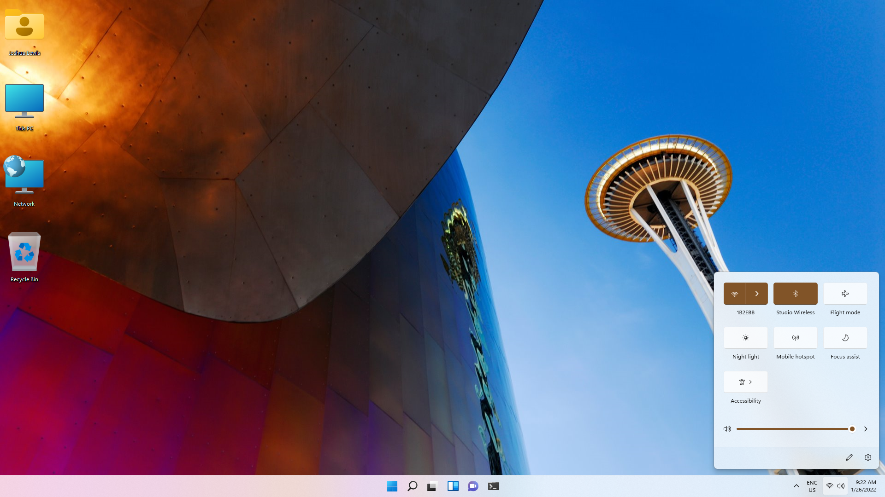
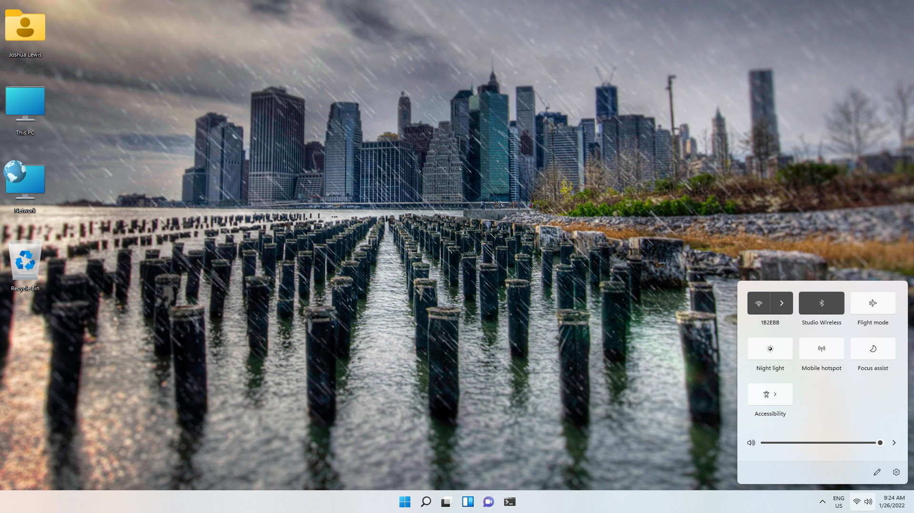
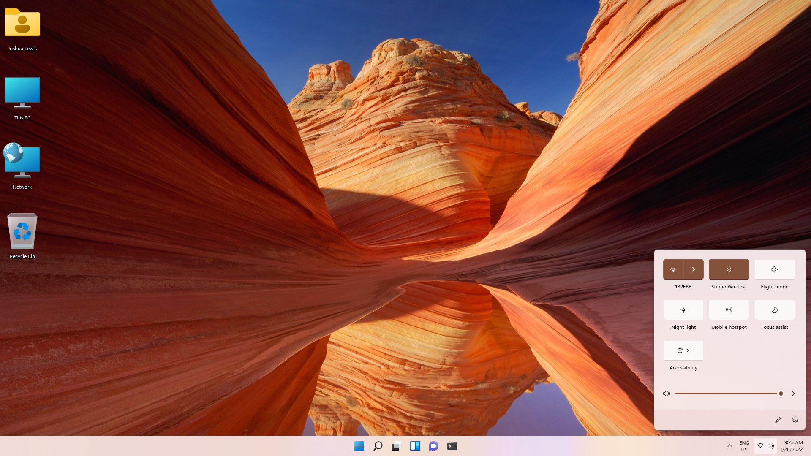
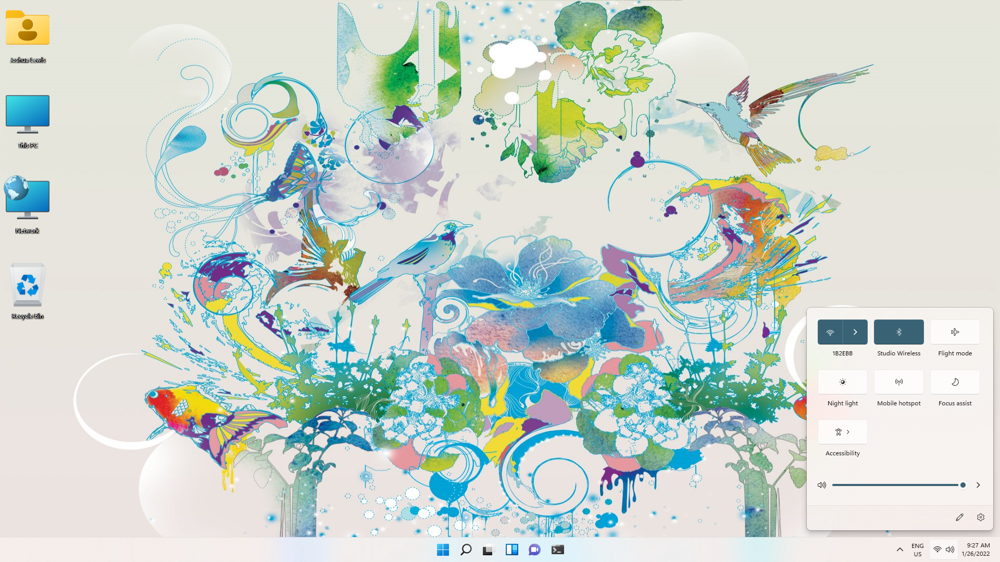

Projects
---

## Architecture
Classic Windows 7 theme ported to work with later versions of Windows

 **Download**: [Architecture](https://github.com/TBR-Development/Windows-Deskthemepacks/tree/main/projects/Architecture/) | **Author**: [Joshua Lewis][PhantomNimbi]

## Characters 
Classic Windows 7 theme ported to work with later versions of Windows

 

 **Download**: [Characters](https://github.com/TBR-Development/Windows-Deskthemepacks/tree/main/projects/Characters/) | **Author**: [Joshua Lewis][PhantomNimbi]

## Cityscapes
Classic Windows 7 theme ported to work with later versions of Windows

 

 **Download**: [Cityscapes](https://github.com/TBR-Development/Windows-Deskthemepacks/tree/main/projects/Cityscapes/) | **Author**: [Joshua Lewis][PhantomNimbi]

## Landscapes
Classic Windows 7 theme ported to work with later versions of Windows

 

 **Download**: [Landscapes](https://github.com/TBR-Development/Windows-Deskthemepacks/tree/main/projects/Landscapes/) | **Author**: [Joshua Lewis][PhantomNimbi]

## Nature
Classic Windows 7 theme ported to work with later versions of Windows

 

**Download**: [Nature](https://github.com/TBR-Development/Windows-Deskthemepacks/tree/main/projects/Nature/) | **Author**: [Joshua Lewis][PhantomNimbi]

##Scenes
Classic Windows 7 theme ported to work with later versions of Windows

 

 **Download**: [Scenes](https://github.com/TBR-Development/Windows-Deskthemepacks/tree/main/projects/Scenes/) | **Author**: [Joshua Lewis][PhantomNimbi]

## United States
Classic Windows 7 theme ported to work with later versions of Windows

 

 **Download**: [United States](https://github.com/TBR-Development/Windows-Deskthemepacks/tree/main/projects/United%20States/) | **Author**: [Joshua Lewis][PhantomNimbi]

## Studio Ghibli
A tribute to the studio behind some of the greatest cult classics of Japanese animation

 

 **Download**: [Studio Ghibli](https://github.com/TBR-Development/Windows-Deskthemepacks/tree/main/projects/Studii%20Ghibli/) | **Author**: [Joshua Lewis][PhantomNimbi

## Howl's Moving Castle
A tribute to one of one of the greatest films by Studio Ghibli

 

 **Download**: [Howl's Moving Castle](https://github.com/TBR-Development/Windows-Deskthemepacks/tree/main/projects/Howls%20Moving%20Castle/) | **Author**: [Joshua Lewis][PhantomNimbi

## Courage TCD
A tribute to one of the greatest cult classics of Western animation

 **Download**: [Courage TCD](https://github.com/TBR-Development/Windows-Deskthemepacks/tree/main/projects/Courage%20TCD/) | **Author**: [Joshua Lewis][PhantomNimbi

[PhantomNimbi]: https://github.com/PhantomNimbi
